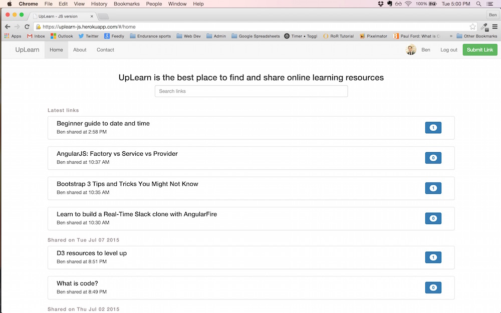

# UpLearn-JS

View this app at: https://uplearn-js.herokuapp.com/

This is an app I'm building as I learn AngularJS and how to integrate an AngularJS front-end with a Rails back-end. I'm rebuilding my previous site, UpLearn (https://uplearn.herokuapp.com/), which was a pure Rails app.
